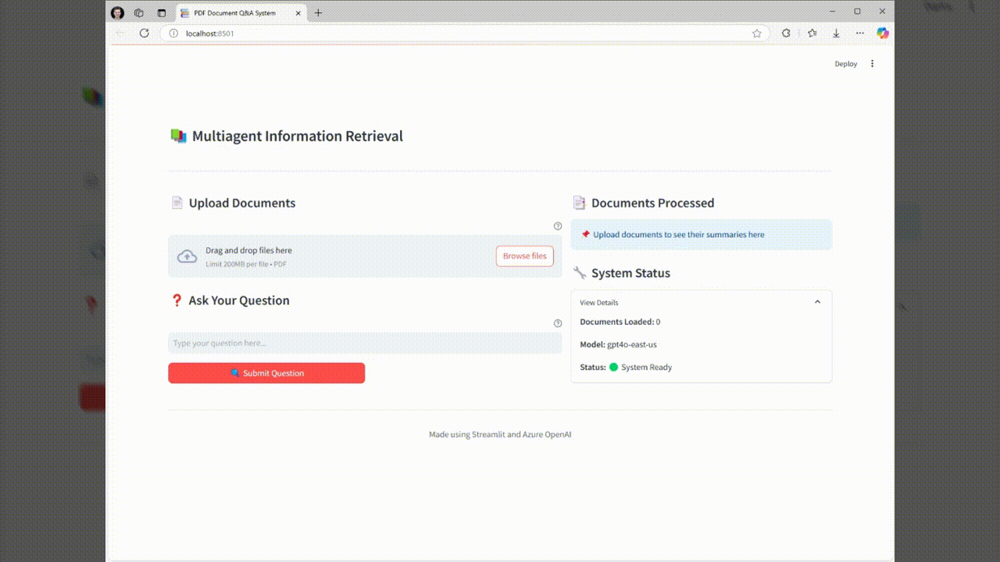

# Multi-agent Document QnA (The NoRAG Alternative) 🤖📚

### Approach
NoRAG MultiAgent Document QnA uses a  team of AI agents that work together to understand documents and answer questions based on them. Rather than using traditional vector embeddings like RAG systems, it relies on intelligent document summarization and contextual relevance scoring. 

The `Document Analysis Agent` first creates comprehensive appendices of documents, the `Research Agent` evaluates question relevance against these appendices, and the `Reply Agent` generates answers using the most relevant document, by loading it in the system message as a whole.




### When to Use Instead of RAG
Choose this solution when:
- You are handling highly complicated documents that RAG struggles with
- The answers are based on multiple parts of the same document
- Context from the whole document might be needed to answer a question
- Looking for a simpler deployment without vector databases
- Need transparent agent-based processing pipeline

### Limitations
- Not designed to handle a large amount of documents (30 documents and over will be a stretch)
- Doesn't perform cross-document answer generation (each answer comes from a single document)
- Higher token usage compared to RAG systems
- May be slower for very large document collections
- Maximum token limit per document chunk (120k tokens)
- Requires Azure OpenAI access 
- No persistent document storage (session-based only)


## 🌟 Key Features

### Multi-Agent Architecture
- **Document Analysis Agent** 📄
  - Processes PDF documents
  - Extracts and chunks text content
  - Generates document summaries
  - Manages token limitations
  
- **Research Agent** 🔍
  - Analyzes question relevance
  - Scores document sections
  - Identifies most pertinent content
  - Provides relevance metrics

- **Reply Agent** 💡
  - Generates accurate answers
  - Uses context-aware processing
  - Maintains source truthfulness
  - Provides clear explanations


## 🚀 Getting Started

### Prerequisites
- Python 3.8+
- Azure OpenAI API access

### Quick Start
```bash
# Clone repository
git clone https://github.com/yourusername/multiagent-doc-qna.git
cd multiagent-doc-qna

# Set up virtual environment
python -m venv venv
source venv/bin/activate  # Unix
.\venv\Scripts\activate   # Windows

# Install dependencies
pip install -r requirements.txt

# Configure environment
cp .env.example .env
# Edit .env with your credentials

# Launch application
streamlit run app.py
```

### Azure OpenAI Setup
1. Create an Azure OpenAI resource
2. Deploy a model
3. Get API credentials
4. Configure environment variables

## 💻 Usage

### Document Upload
1. Launch the application
2. Click "Upload Documents"
3. Select one or more PDF files
4. Wait for processing completion

### Asking Questions
1. Type your question in the input field
2. Click "Submit Question"
3. View document relevance scores
4. Read the generated answer

### Understanding Results
- **Relevance Scores**: Shows how relevant each document is to your question
- **Token Counts**: Displays processing efficiency metrics
- **Document Summaries**: Provides quick content overview
- **System Status**: Shows real-time processing information

## 🛠 Technical Details

### Token Management
- Maximum tokens per chunk: 120,000
- Automatic chunking for large documents
- Token count monitoring
- Optimization for Azure OpenAI context limits


## 🔒 Security

### Data Protection
- No document storage
- Session-only processing


### Running FastAPI Server
To run the FastAPI server, use the following command:
```bash
uvicorn api:app --reload
```

### API Endpoints
The following endpoints are available in the FastAPI server:

- **Token Counting**
  - **Endpoint**: `/count_tokens/`
  - **Method**: `POST`
  - **Request Body**: `{"text": "Your text here"}`
  - **Response**: `{"token_count": 123}`

- **Text Chunking**
  - **Endpoint**: `/split_text/`
  - **Method**: `POST`
  - **Request Body**: `{"text": "Your text here"}`
  - **Response**: `{"chunks": ["chunk1", "chunk2"]}`

- **PDF Text Extraction**
  - **Endpoint**: `/extract_text/`
  - **Method**: `POST`
  - **Request Body**: PDF file upload
  - **Response**: `{"chunks": ["chunk1", "chunk2"], "chunk_tokens": [100, 200]}`

- **Document Summarization**
  - **Endpoint**: `/summarize/`
  - **Method**: `POST`
  - **Request Body**: `{"text": "Your text here"}`
  - **Response**: `{"summary": "Summary of the text"}`

- **Document Chunk Processing**
  - **Endpoint**: `/process_chunks/`
  - **Method**: `POST`
  - **Request Body**: `{"file_name": "document.pdf", "chunks": ["chunk1", "chunk2"], "chunk_tokens": [100, 200]}`
  - **Response**: `{"documents": {"doc1": "text1"}, "summaries": {"doc1": "summary1"}, "token_counts": {"doc1": 100}}`

- **Document Relevance Selection**
  - **Endpoint**: `/select_relevant/`
  - **Method**: `POST`
  - **Request Body**: `{"question": "Your question here", "summaries": {"doc1": "summary1"}}`
  - **Response**: `{"most_relevant": "doc1", "relevance_scores": {"doc1": 90}}`

- **Question Answering**
  - **Endpoint**: `/get_answer/`
  - **Method**: `POST`
  - **Request Body**: `{"question": "Your question here", "document_text": "Relevant document text"}`
  - **Response**: `{"answer": "Answer to your question"}`
